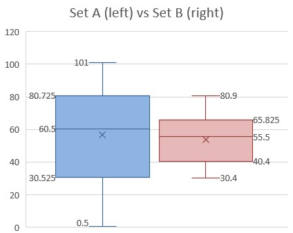

# TITLE OF THIS WEBSITE
This branch will be used for a sample website.

Let us insert an image:

Here is the syntax to insert an image:

!  followed by [alt text] followed by a link included between parentheses ().

Note that the images must be uploaded in an image folder in the same github repository.

The image should above here.

This is a very simple website, but we can add themes next time.
